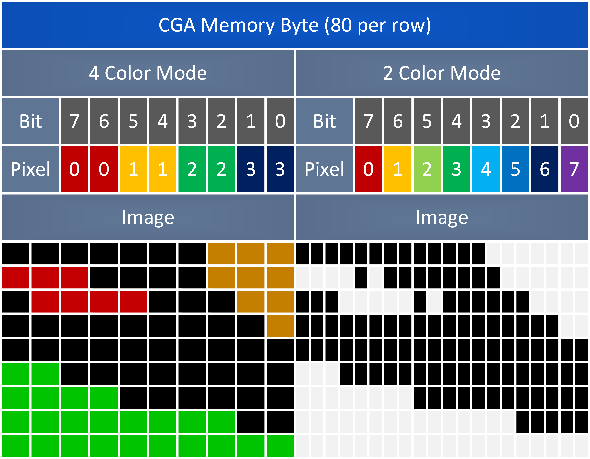
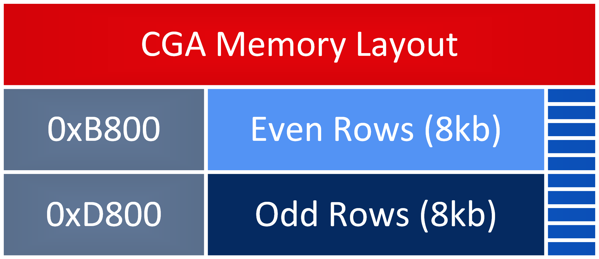
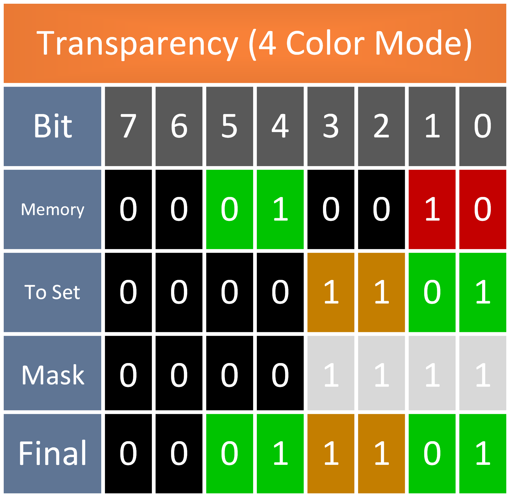
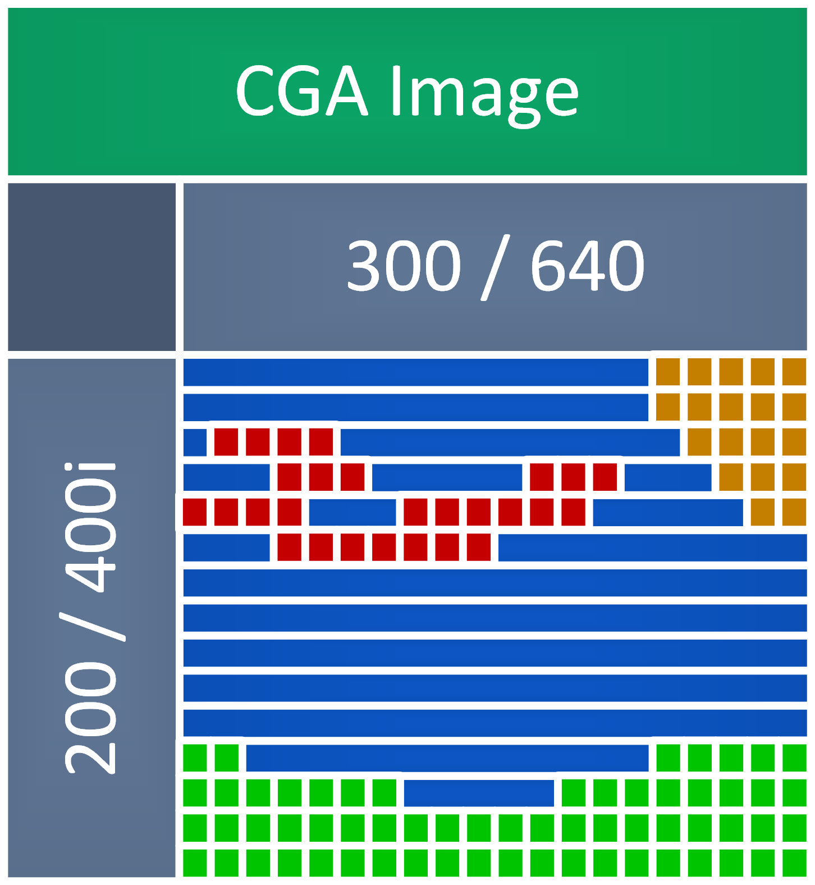
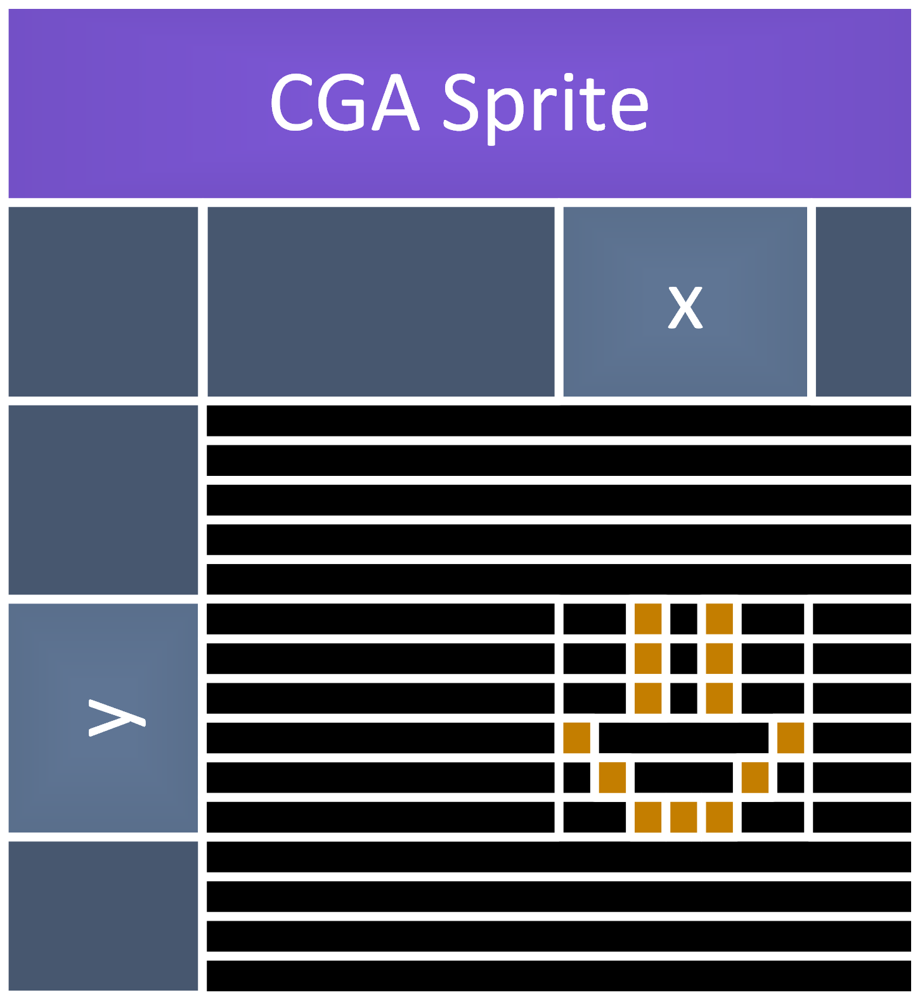
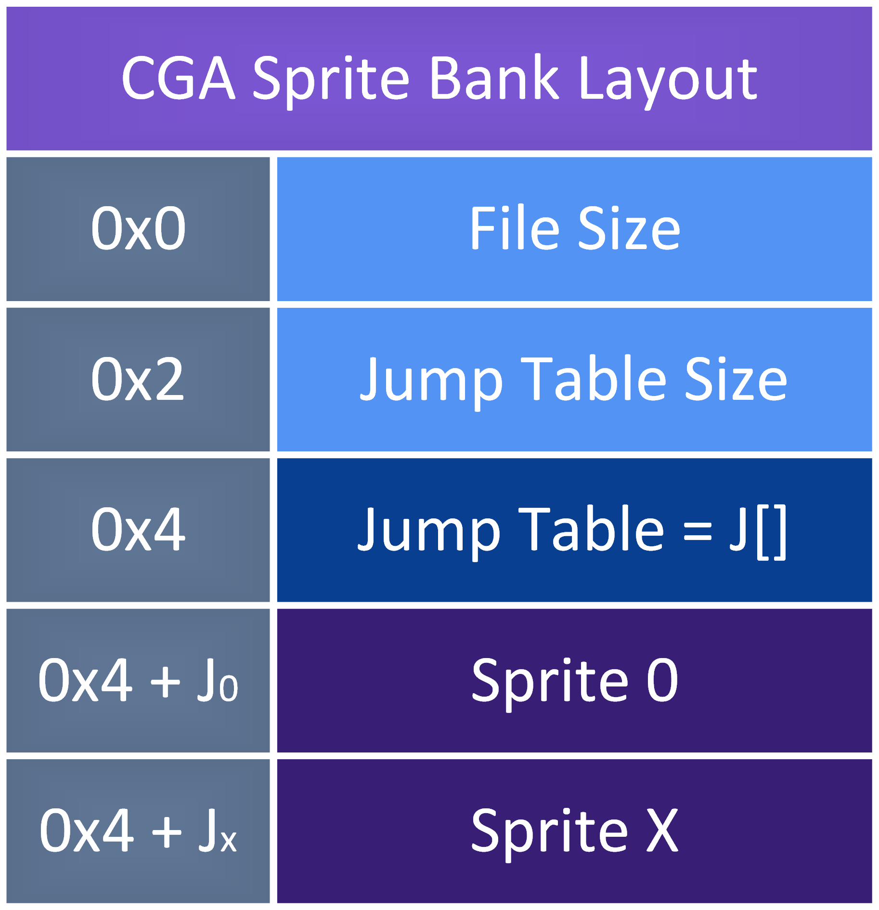
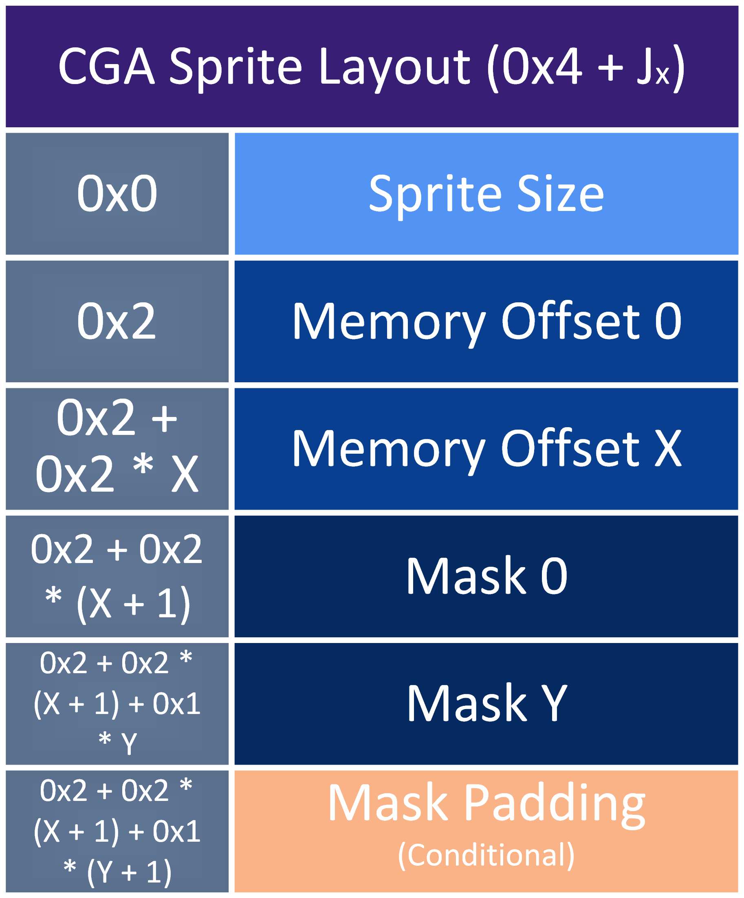

# CGA Media library

The following file formats were developed to allow for a conceptual media standard to be used within **StriderWar**. They are tightly coupled with the CGA video memory layout on the IBM PC Jr. Only `.cga` and `.cgs` are used for **StriderWar**.

Throughout this readme, this conceptual format will be simply referred to as the **CGA format**.

> [!NOTE]
> Unless otherwise specified, each individual value is a `u16` (i.e. 2 bytes) or is aligned to `u16` as that is what the PCJr works in.

## Common Functionality

The following applies to the **CGA format** in general.

### Coupling with Memory Layout

The **CGA format** is stored to be process efficient. Each pixel (or set of pixels) can simply be read in and then written directly to video memory. The trade off is that this creates a tight coupling with the video memory layout on the PCJr.

#### IBM PC Jr. Video Memory layout

The **CGA format** is specifically tailored for the PCJr, as such.

Here we can see the format of a CGA byte in memory. For each pixel, 2 bits are used in 4 color mode, and 1 bit in 2 color mode. This is the same format that data is saved in the **CGA format** in terms of pixel info. This allows for directly copying and masking to and from memory.

<!-- TODO: Make CGA Images split into even and odd rows to remove the need to manually alternate at render time -->

Take note that video memory is split into even and odd rows. This may or may not be relevant, dependent on the format specialization.

### Transparency

Format specialization implementations handle the specifics of transparency differently, but function in the same way.

Going top to bottom, note the following sections in this example for a 4 color mode transparency operation

> [!NOTE]
> The colors in the 'memory bits' correspond to the actual color presented, except for the "Mask" and "Bit" layers.

- Memory
  - What is currently in video memory
- To Set
  - What we want to set (i.e. bits in an image)
- Mask
  - What bits to set
- Final
  - Resulting video memory

Depending on the specialization, the mask is either generated at runtime or pre-calculated.

### Color Palette

No metadata is included in regards to what color palette to use. The addition of this would be straightforward, but simply was deemed irrelevant for its use case. Additionally, it would add more (albeit minor) complexity to the simpler specializations.

## Specialization

### CGA Image

CGA Images are meant to be streamed from a file straight to video memory, performing transparency if necessary. It is enough to simply read in the file and begin directly copying to video memory. The only prerequisite to this is to correctly set the video mode based on the file extension.

The distinction between types are only dictated by their file extension, the rendering program can choose to follow it / support different formats.

- `.cga` - 4 color : 320x200
- `.cgi` - 4 color : 320x400i
  - Every other row is skipped (final binary effectively the same as a .cga)
- `.hga` - 2 color : 640x200
- `.hgi` - 2 color : 640x400i
  - Every other row is skipped (final binary effectively the same as a .hga)

*For illustrative purposes each line is not split into even and odd rows here, but the actual binary would be.*

CGA Images contain no metadata in the actual binary. Because of this, the size of the image is based on the video mode. i.e. the image size matches the video mode size it corresponds to. Every byte on screen can / will be written to.

### CGA Sprite Bank

CGA Sprites are meant to be loaded into memory and treated as static sprites. Translation / positional manipulation of a sprite is not defined nor supported by this format. The format is defined to be loaded into structs to then be continuously rendered and updated in color. Sprites are a single color only, no actual color info is included in a sprite bank, only pixel data.

- `.cgs` - 4 color : Variable size

Only the relevant bytes are written to. No other bytes (Lines in black) are stored. This means an offset and mask are generated for each 'CGA Memory Byte' that needs to be written to as part of a sprite.

Here is what the binary layout of a `.cgs` looks like. Note that "Sprite" is broken down in the next graphic, as the offsets compound.

Mask Padding is only used when there are an odd number of masks. This is because masks are `u8`s while `.cgs` should be aligned to `u16`.

## Generate Media

Conversions happen from PNG to relevant CGA specialization. This is done through a few Python scripts.

### Requirements

- [Python](https://www.python.org/) >= 3.13
  - `pip install -r scripts\requirements.txt`

### Usage

Run the following commands to get usage output from each script.

- `python scripts\cga_sprite.py -h`
  - Generate a CGA sprite bank from a PNG.
- `python scripts\png2cga.py -h`
  - Generate a CGA image from a PNG.
